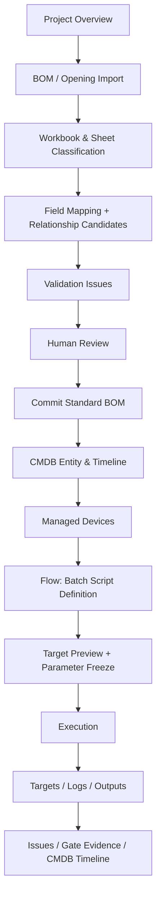
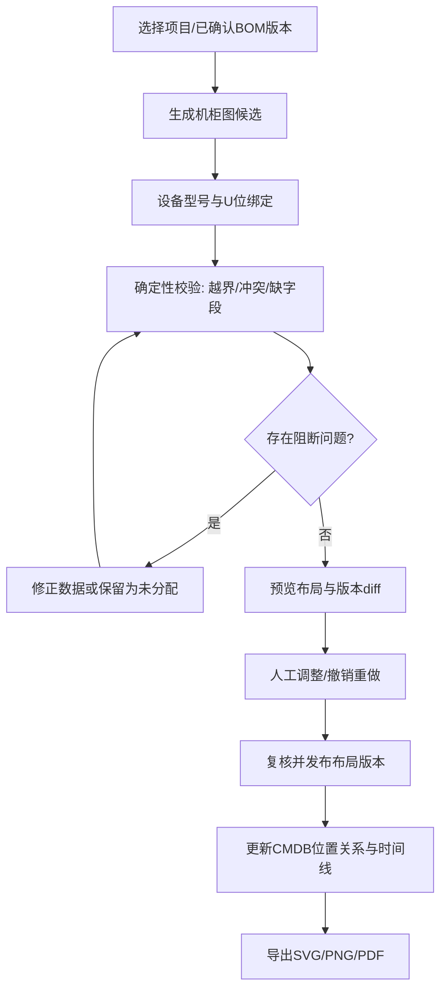
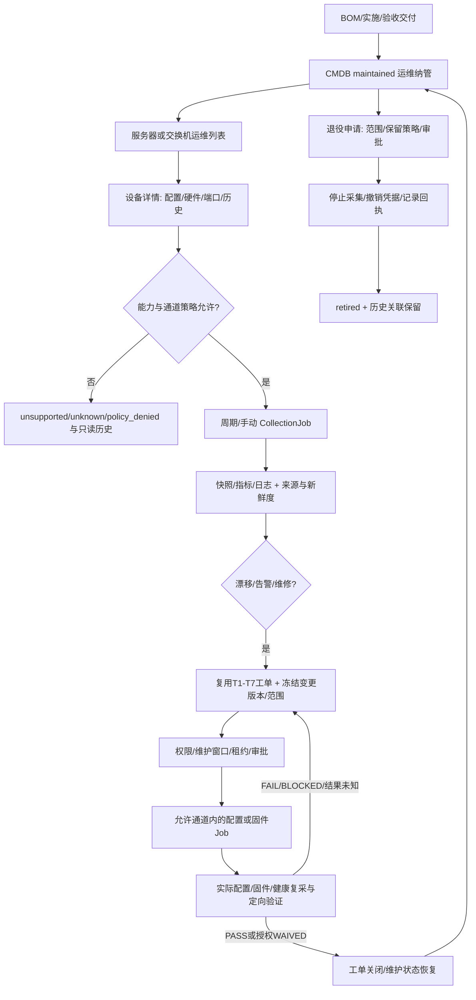

# ke el UI flows (Mermaid)

```mermaid
flowchart TD
  A[Project Overview] --> B[BOM / Opening Import]
  B --> C[Workbook & Sheet Classification]
  C --> D[Field Mapping + Relationship Candidates]
  D --> E[Validation Issues]
  E --> F[Human Review]
  F --> G[Commit Standard BOM]
  G --> H[CMDB Entity & Timeline]
  H --> I[Managed Devices]
  I --> J[Flow: Batch Script Definition]
  J --> K[Target Preview + Parameter Freeze]
  K --> L[Execution]
  L --> M[Targets / Logs / Outputs]
  M --> N[Issues / Gate Evidence / CMDB Timeline]
```

## Rack Diagram 自动生成流程

```mermaid
flowchart TD
  A[选择项目/已确认BOM版本] --> B[生成机柜图候选]
  B --> C[设备型号与U位绑定]
  C --> D[确定性校验: 越界/冲突/缺字段]
  D --> E{存在阻断问题?}
  E -->|是| F[修正数据或保留为未分配]
  F --> D
  E -->|否| G[预览布局与版本diff]
  G --> H[人工调整/撤销重做]
  H --> I[复核并发布布局版本]
  I --> J[更新CMDB位置关系与时间线]
  J --> K[导出SVG/PNG/PDF]
```

## OPS-2026-10-29 · 交付后运维设计增补

```mermaid
flowchart TD
  A[BOM/实施/验收交付] --> B[CMDB maintained 运维纳管]
  B --> C[服务器或交换机运维列表]
  C --> D[设备详情: 配置/硬件/端口/历史]
  D --> E{能力与通道策略允许?}
  E -->|否| F[unsupported/unknown/policy_denied 与只读历史]
  E -->|是| G[周期/手动 CollectionJob]
  G --> H[快照/指标/日志 + 来源与新鲜度]
  H --> I{漂移/告警/维修?}
  I -->|是| J[复用T1-T7工单 + 冻结变更版本/范围]
  J --> K[权限/维护窗口/租约/审批]
  K --> L[允许通道内的配置或固件Job]
  L --> M[实际配置/固件/健康复采与定向验证]
  M -->|PASS或授权WAIVED| N[工单关闭/维护状态恢复]
  M -->|FAIL/BLOCKED/结果未知| J
  N --> B
  B --> O[退役申请: 范围/保留策略/审批]
  O --> P[停止采集/撤销凭据/记录回执]
  P --> Q[retired + 历史关联保留]
```

所有节点受maintained/IPMI-only限制；维修、审批、重试、升级和回滚不包含恢复SSH/Agent/Redfish的隐藏步骤。交付CleanupRun与最终退役是两条不同流程。
